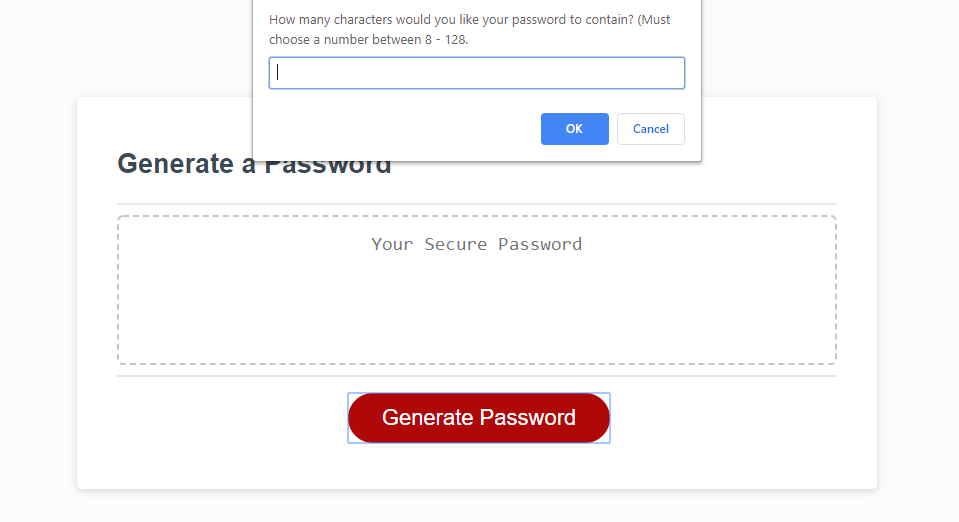
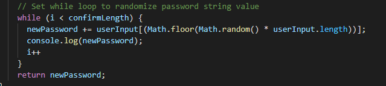
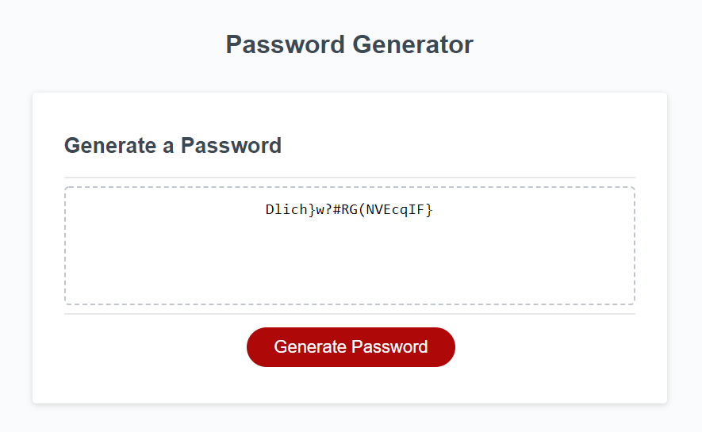

# Password Generator

This password generator provides the user with a random series of characters based on the user's preferred criteria. The generator will prompt the user to enter their desired length of the password. Then it will confirm if specific character types would like to be incorporated.

 

 

## Coding Process

This was an extremely difficult project to get through with many trial and error attempts. I was able to setup the string array properties easily along with the prompt and confirm values; however, getting it to produce a random password was quite the struggle. After researching and reworking the if statements, I was able to get the password to generate with a modified random number source code wrapped in a while loop.

Please view the source code below.

 

  

 

To view the live website, please navigate to the **Deployed Link** below or  [click here](https://christyglee.github.io/Password-Generator/) to view the page.

 

## Powered By

* [HTML](https://developer.mozilla.org/en-US/docs/Web/HTML)
* [CSS](https://developer.mozilla.org/en-US/docs/Web/CSS)
* [Javascript](https://developer.mozilla.org/en-US/docs/Web/JavaScript)

 

### Other Resources Used

* [Visual Studio Code](https://code.visualstudio.com/)
    * [How to install VS Code](https://code.visualstudio.com/docs/setup/setup-overview)
* [GitBash](https://gitforwindows.org/)
    * [Download GitBash for Windows](https://git-scm.com/downloads)

 

## Deployed Link

* [See Live Site](https://christyglee.github.io/Password-Generator/)

 

## Author
**Christy Lee** 

- [Github](https://github.com/christyglee)
- [LinkedIn](https://www.linkedin.com/in/christy-lee-95943748/)

  

## Acknowledgments

* [Google-Fu](https://www.google.com)
* [w3schools](https://www.w3schools.com/)
* [Stack Overflow](https://stackoverflow.com/search?q=over)